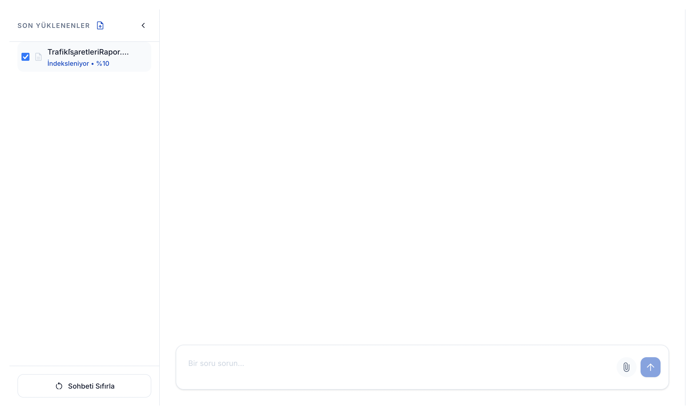
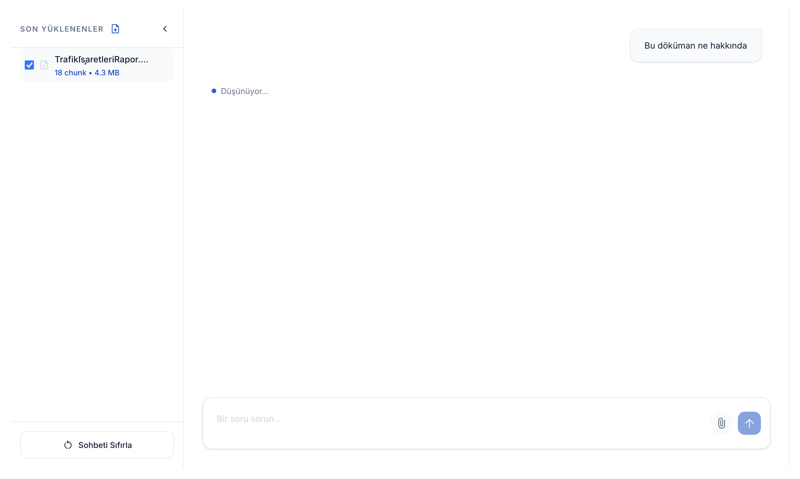
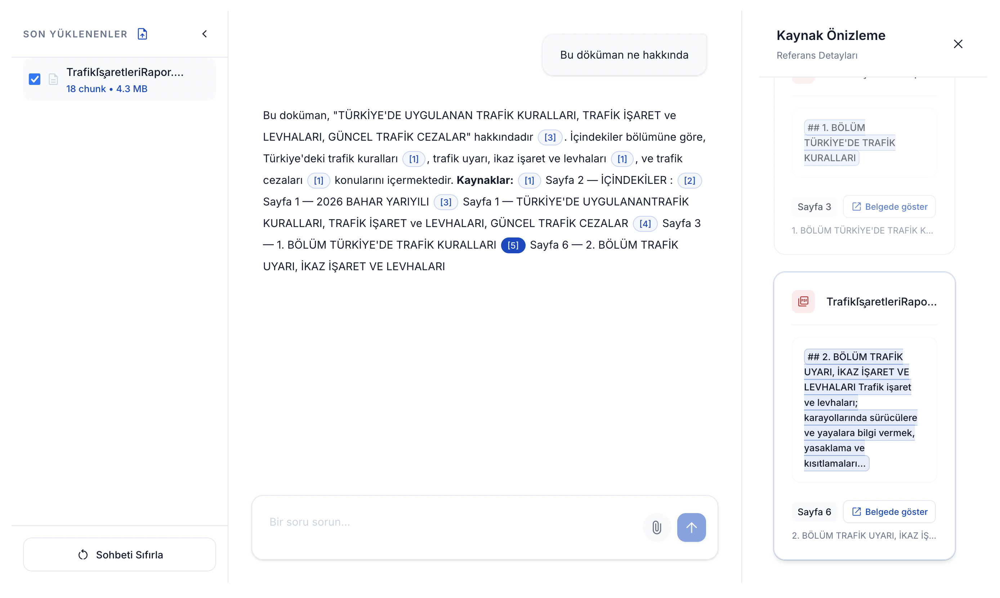
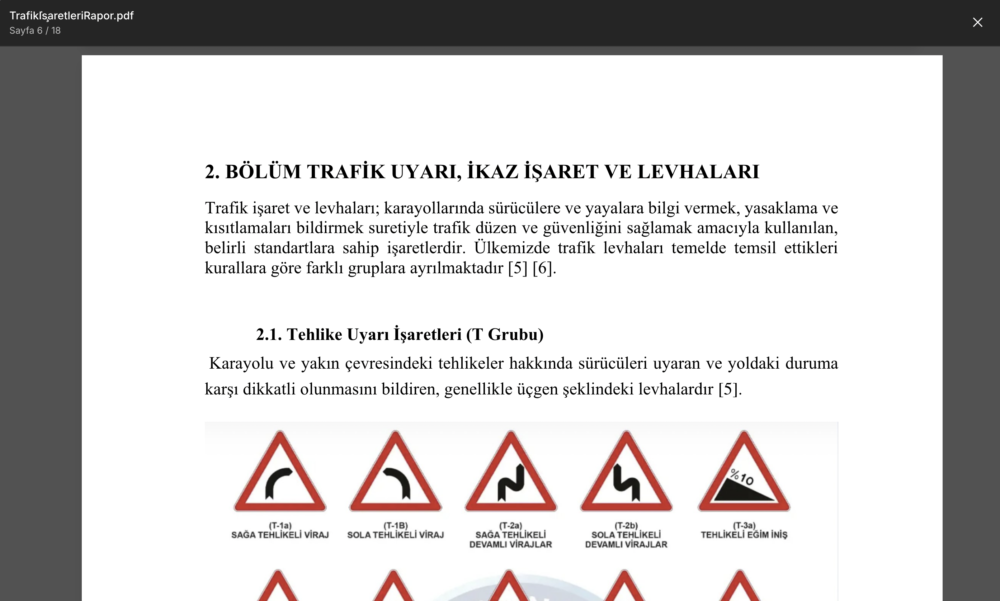

# Docling RAG Assistant

<p align="center">
  <a href="backend/requirements.txt" title="Backend (Python/Flask)">
    
  </a>
  <a href="backend/requirements.txt" title="Flask API">
    
  </a>
  <a href="frontend/package.json" title="Frontend (React)">
    
  </a>
  <a href="backend/requirements.txt" title="Docling parser">
    
  </a>
  <a href="backend/requirements.txt" title="ChromaDB vector store">
    
  </a>
  <a href="backend/requirements.txt" title="Gemini (Google GenAI)">
    
  </a>
  <a href="backend/pytest.ini" title="pytest">
    
  </a>
  <a href="frontend/package.json" title="Vitest">
    
  </a>
</p>

Docling + ChromaDB + Gemini ile geliştirilmiş, **belge yükleme → yüksek kaliteli ayrıştırma → yapısal/bölütlenmiş indeks → semantik arama → kaynaklı yanıt** akışını hedefleyen RAG tabanlı doküman asistanı.

## Ekran Görüntüleri

### İndeksleniyor



### Soru



### Cevap



### PDF Viewer



## Hızlı başlangıç

### 1) Ortam değişkenleri (`.env`)

Bu projede hem backend hem de frontend ayarları **repo kökündeki** tek bir `.env` dosyasından okunur.

```bash
# Şablonu kopyala
cp .env.example .env
```

Ardından `.env` dosyasını açıp aşağıdaki alanları düzenle.

#### macOS için önerilen minimum ayarlar

macOS’ta `5000` portu dolu olduğundan, **`5001` kullanman önerilir**:

- `API_PORT` ve `VITE_API_URL` portları **aynı** olmalı (örn: `5001`).
- `API_PORT=5001`
- `VITE_API_URL=http://localhost:5001`
- Gerçek embedding/RAG için `GEMINI_API_KEY=...` girmen gerekli. Yoksa test/CI ve geliştirme sırasında sistem sahte bileşenlerle çalışır.

### 2) Backend (Flask)

```bash
cd backend
python -m venv .venv
source .venv/bin/activate
pip install -r requirements.txt
python run.py
```

Health: `http://127.0.0.1:<API_PORT>/api/health`

### 3) Frontend (React + Vite + Tailwind)

```bash
cd frontend
npm install
npm run dev
```

Tarayıcı: `http://localhost:5173`

Not: Vite, kök `.env` dosyasını okur.

## Kullanılan teknolojiler

### Backend

- **Flask**: HTTP API (`backend/app/blueprints/*`)
- **Docling**: PDF/DOCX/TXT ayrıştırma (`backend/app/infrastructure/docling_adapter.py`)
- **ChromaDB**: vektör veritabanı (`backend/app/infrastructure/chroma_vector_store.py`)
- **Gemini (google-genai)**:
  - **Embedding** (`backend/app/infrastructure/gemini_embedding.py`)
  - **LLM** (`backend/app/infrastructure/gemini_llm.py`)
- **python-dotenv**: repo kök `.env` yükleme (`backend/app/env_loader.py`)
- **pytest**: unit/integration/UAT testleri (`backend/tests/*`)

### Frontend

- **React + Vite**: uygulama iskeleti (`frontend/src/*`, `frontend/vite.config.ts`)
- **TailwindCSS**: stil altyapısı (`frontend/src/index.css`, `frontend/src/theme/*`)
- **react-pdf / pdfjs-dist**: PDF görüntüleme ve kaynak paneli (`frontend/src/components/DocumentViewerModal.tsx`)
- **Vitest + React Testing Library**: testler (`frontend/src/**/*.test.ts(x)`)

## Proje yapısı

- `backend/`
  - `app/blueprints/`: HTTP uçları (health/documents/chat/sources)
  - `app/services/`: iş mantığı (doküman işleme, chunking, indeksleme, RAG)
  - `app/infrastructure/`: dış sistem adaptörleri (Docling, Chroma, Gemini, Fake*)
  - `app/ports/`: arayüzler (LLM/Embedding/Docling/VectorStore)
  - `app/domain/`: domain modelleri ve hatalar
  - `tests/`: unit + integration + uat
- `frontend/`
  - `src/api/`: API client + tipler + mock katmanı
  - `src/components/`: UI bileşenleri (sidebar/chat/source panel/pdf viewer)
  - `src/utils/`: parse/format yardımcıları (citation, pdf scroll vb.)

## Kod/Rapor Haritası


### Gereksinim Analizi (Use Case tabanlı)

- **UC1 — Doküman Yükleme**
  - API: `backend/app/blueprints/documents.py`
  - Doğrulama: `backend/app/services/upload_validator.py`
  - Dosya kayıt + registry: `backend/app/services/file_store.py`
  - Testler: `backend/tests/unit/test_upload_validation.py`, `backend/tests/integration/test_documents_api.py`
- **UC2 — Doküman Ayrıştırma + Bölütleme**
  - Orkestrasyon: `backend/app/services/document_processor.py`
  - Docling adaptörü: `backend/app/infrastructure/docling_adapter.py` (testte: `fake_docling_parser.py`)
  - Son işleme:
    - Üst/alt bilgi temizleme: `backend/app/services/header_footer_stripper.py`
    - Tablo sürekliliği: `backend/app/services/table_continuity_merger.py`
  - Bölütleme:
    - Yapısal (H1/H2): `backend/app/services/structural_chunker.py`
    - Yinelemeli (token + overlap): `backend/app/services/recursive_splitter.py`
  - Opsiyonel LLM zenginleştirme: `backend/app/services/contextual_chunk_enricher.py`
  - Testler: `backend/tests/integration/test_docling_chunking.py` + `backend/tests/unit/test_*chunk*.py`
- **UC3 — Embedding + Saklama (ChromaDB)**
  - İndeksleme: `backend/app/services/indexing_service.py`
  - Embedding:
    - Canlı: `backend/app/infrastructure/gemini_embedding.py`
    - Test/CI: `backend/app/infrastructure/deterministic_embedding.py`
  - Vector store: `backend/app/infrastructure/chroma_vector_store.py`
  - Silme/cascade: `backend/tests/integration/test_document_delete_cascade.py`
- **UC4 — Soru Sorma / Retrieval / Halüsinasyon Koruması**
  - Sorgu validasyonu: `backend/app/services/query_validator.py`
  - Pipeline (retrieval): `backend/app/services/query_pipeline.py`
  - Eşik filtresi: `backend/app/services/context_filter.py` (`SIMILARITY_THRESHOLD`)
  - API: `backend/app/blueprints/chat.py`
  - Testler: `backend/tests/unit/test_query_validation.py`, `backend/tests/unit/test_context_filter.py`, `backend/tests/integration/test_chat_api_search.py`
- **UC5 — Kaynak Görüntüleme**
  - Son kaynaklar: `backend/app/blueprints/sources.py`, `backend/app/services/source_preview_service.py`
  - Frontend kaynak paneli: `frontend/src/components/SourcePanel.tsx`
  - PDF içinde referansa gitme: `frontend/src/components/DocumentViewerModal.tsx`, `frontend/src/utils/pdfViewerScroll.ts`

### Tasarım Modellemesi (Design Modeling)

- **Mimari tasarım (Katmanlı + Ports/Adapters)**
  - Bağımlılık enjeksiyonu ve “hangi ortamda hangi adaptör”: `backend/app/__init__.py`
  - Ports: `backend/app/ports/*`
  - Infrastructure adapters: `backend/app/infrastructure/*`
- **Arayüz tasarımı**
  - Uygulama kabuğu (3 panel): `frontend/src/components/AppShell.tsx`
  - Sol panel (belge listesi + yükleme): `frontend/src/components/DocumentSidebar.tsx`, `frontend/src/components/GlobalDropZone.tsx`
  - Orta panel (chat): `frontend/src/components/ChatPanel.tsx`
  - Sağ panel (kaynaklar): `frontend/src/components/SourcePanel.tsx`
- **Bileşen düzeyi tasarım (RAG)**
  - RAG engine + prompt: `backend/app/services/rag_engine.py`, `backend/app/services/rag_prompt.py`
  - Guard (bağlam yoksa LLM yok): `backend/app/services/rag_engine.py` + `ContextFilter`

## Yapılandırma ve önemli ortam değişkenleri

Tüm değişkenler için örnek dosya: `.env.example`

Öne çıkanlar:

- `ENABLE_LLM_CHUNK_ENRICHMENT`: `true` ise Docling çıktısı LLM ile bağlamsal olarak “düzeltilir/etiketlenir”. Değiştirdikten sonra **belgeleri yeniden yükleyin** (chunk’lar ve Chroma yeniden oluşur).
- `SIMILARITY_THRESHOLD`: retrieval için alt eşik. Altında bağlam “yetersiz” sayılır ve LLM çağrısı yapılmaz (halüsinasyon koruması).
- `DOCLING_DEVICE` + `DOCLING_ALLOW_MPS`: macOS’ta MPS kaynaklı layout sorunlarını yönetmek için.

### macOS OCR notu

`backend/requirements.txt` içindeki `ocrmac` satırı yalnızca macOS’ta kurulur (`sys_platform == 'darwin'`). Docling OCR seçenekleri içinde Vision tabanlı OCR için kullanılır.

## Testler

### Backend

```bash
cd backend
pytest
```

Test altyapısı ve bağımlılıklar:

- `backend/pytest.ini`: pytest yapılandırması (marker tanımları, `testpaths`, `addopts`). README’de referans verilen `tc_uat`, `rag_eval`, `gemini_live` gibi marker’lar burada tanımlıdır.
- `backend/requirements.txt`: backend’in **ana bağımlılık listesi** (Flask, Docling, ChromaDB, `google-genai`, pytest vb.). Günlük geliştirme ve standart test çalıştırmaları için yeterlidir.
- `backend/requirements-eval.txt`: **opsiyonel** değerlendirme bağımlılıkları (RAGAS gibi). Sadece `rag_eval` testlerini/kalite metriklerini çalıştırmak istediğinde kurulur (`GEMINI_API_KEY` gerektirir).

### Frontend

```bash
cd frontend
npm test
```

## Geliştirme notları

- Backend, repo kök `.env` dosyasını otomatik yükler (`backend/app/env_loader.py`).
- Frontend, repo kök `.env` dosyasını okur (`frontend/vite.config.ts`).
- Test ortamında dış bağımlılıklar sahte implementasyonlara düşer (`FakeLLM`, `DeterministicEmbedding`, `FakeDoclingParser`).